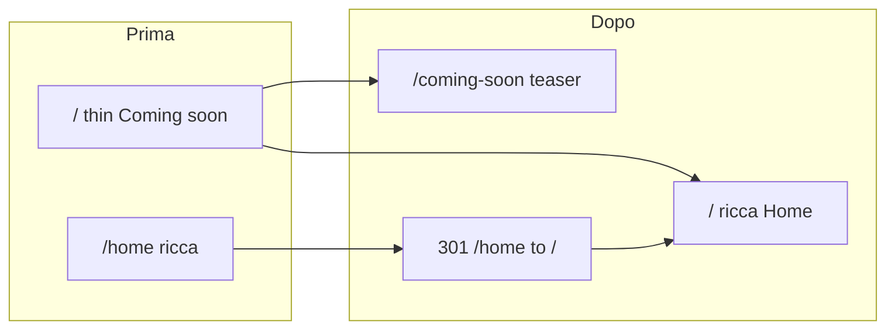

# Piano SEO tecnico per ianuacare (Vite + React SPA)

## Contesto dall’analisi del codice

| Area | Stato attuale | Effetto sulla ricerca |
|------|-----------------|------------------------|
| Routing | [`src/App.tsx`](src/App.tsx): `/` = Coming soon, contenuto ricco solo su `/home` | La URL principale che gli utenti e molti crawler vedono per prima è **contenuto sottile** (“coming soon”), mentre il marketing è su un path secondario — sfavorevole all’intento di far indicizzare la home “vera”. |
| `<head>` | [`index.html`](index.html): titolo e description ancora “Coming soon” | Snippet SERP e anteprime social non riflettono il valore del sito. |
| Crawl hints | Nessun `public/robots.txt` né sitemap nel repo | Manca un segnale esplicito di URL preferite e copertura (utile ma non sufficiente da solo). |
| Header / link interni | [`src/components/Header.tsx`](src/components/Header.tsx): logo → `/home`; [`src/copy/home.ts`](src/copy/home.ts): footer “Coming soon” → `/` | Link interni incoerenti con una URL canonica chiara. |
| Heading | [`src/components/sections/Hero.tsx`](src/components/sections/Hero.tsx): `<h1 className={styles.srOnly}>Ianua</h1>` | Titolo di pagina molto generico per accessibilità/SEO on-page (migliorabile in un secondo step). |

**Allineamento alla tua scelta:** spostare la Home ricca su **`/`** e la teaser “Coming soon” su **`/coming-soon`**.

## Aspettative (onesto rispetto a Google Search Central)

Google **non garantisce posizioni** né il “primo risultato”; obiettivi realistici sono: **indicizzazione corretta**, titoli/description utili negli snippet, canonical che consolidano le duplicazioni, contenuto utile e coerente con le query ([documentazione generale sul funzionamento della Ricerca](https://developers.google.com/search/docs/fundamentals/how-search-works)). Il lavoro qui **migliora la base tecnica e la presentazione in SERP**, non sostituisce autorità di dominio, link esterni o intento delle query competitive.

---

## Modifiche da implementare (dopo approvazione del piano)

### 1. Routing e redirect

- **`App.tsx`**: `path="/"` → `Home`; aggiungere `path="/coming-soon"` → `ComingSoon`; rimuovere o mantenere `/home` solo come alias.
- **Retrocompatibilità**: chi ha segnalibri su `/home` deve arrivare alla nuova home: in [`vercel.json`](vercel.json) redirect **301** da `/home` e `/home/` a `/` (prima del rewrite SPA) ([consolidamento URL duplicati](https://developers.google.com/search/docs/crawling-indexing/consolidate-duplicate-urls)).
- **Catch-all**: valutare se `*` deve ancora puntare a `/` (Home) — resta sensato per SPA.

### 2. Meta dinamiche per route (SPA)

- Aggiungere **`react-helmet-async`**: wrapper `HelmetProvider` in [`src/main.tsx`](src/main.tsx) (o dove monti l’app).
- In **`Home`** e **`ComingSoon`**: `<Helmet>` con `title`, `meta name="description"`, Open Graph (`og:title`, `og:description`, `og:url`, `og:type`, `og:locale`), Twitter Card dove ha senso, **`link rel="canonical"`** con URL assoluto ([snippet / meta description](https://developers.google.com/search/docs/appearance/snippet), [canonical](https://developers.google.com/search/docs/crawling-indexing/consolidate-duplicate-urls)).
- **Variabile ambiente**: es. `VITE_SITE_URL=https://www.tuodominio.it` (senza slash finale) per costruire canonical e `og:url` in modo corretto su Vercel vs staging. Fallback documentato per build locale.

### 3. Aggiornare default in `index.html`

- Titolo/description di **fallback** coerenti con la Home principale (per chi visualizza HTML prima dell’idratazione) — ancora utili per tool che leggono solo il file statico ([basics JS e rendering](https://developers.google.com/search/docs/crawling-indexing/javascript/javascript-seo-basics)).

### 4. `robots.txt` e sitemap

- Creare [`public/robots.txt`](public/public/) con `Allow: /` e riga **`Sitemap:`** verso URL assoluto ([intro robots](https://developers.google.com/search/docs/crawling-indexing/robots/intro), [sitemap](https://developers.google.com/search/docs/crawling-indexing/sitemaps/build-sitemap)).
- Creare **`public/sitemap.xml`** con le URL pubbliche (`/` e `/coming-soon`). Se il dominio è solo noto in build-time, **generazione statica** con placeholder + istruzioni per sostituire il dominio, oppure piccolo script `prebuild` che riscrive il dominio da env (da decidere in implementazione per minimizzare errori).

### 5. Dati strutturati (solo ciò che è vero in pagina)

- In **`Home`** (o componente dedicato tipo `JsonLdOrganization.tsx`): JSON-LD **`Organization`** (e eventuale **`WebSite`**) con `name`, `url`, `logo` solo se si usa un’immagine pubblica stabile, `contactPoint`/`email` coerenti con quanto già visibile (es. `info@ianua.it` nel footer) — [linee guida Organization](https://developers.google.com/search/docs/appearance/structured-data/organization). Nessun `SearchAction` se non esiste una ricerca sul sito.

### 6. Link interni e copy

- [`src/components/Header.tsx`](src/components/Header.tsx): `onHomeRoute` su `/` (e variante con slash se necessario); `Link` logo da `/home` a **`/`**.
- [`src/copy/home.ts`](src/copy/home.ts): voce footer “Coming soon” → **`/coming-soon`**.
- [`src/components/sections/SiteFooter.tsx`](src/components/sections/SiteFooter.tsx): verificare la logica `isExternalRoute` / `Link` per `"/"` dopo il cambio (resta link interno alla Home).

### 7. Immagine Open Graph

- Aggiungere **`public/og-image.png`** (1200×630 consigliati da molte piattaforme) o puntare `og:image` a un asset esistente con URL assoluto — necessario per condivisioni social credibili (non è richiesta specifica “ranking” ma migliora CTR quando il link viene condiviso).

### 8. (Facoltativo) Documentazione SEO nel repo

- Per aderire al processo **seo-expert**: creare `docs/specs/seo/audits/SEO-001-ianua-spa-technical-audit.md` usando il template in `.claude/skills/seo-expert/templates/`, con **ogni raccomandazione citata** da pagine Search Central — separato dal codice, utile per tracciabilità. **Solo se lo chiedi esplicitamente** nella fase implementativa (evita markdown non richiesto per user rules).

---

## Verifica post-implementazione

- Build `npm run build` e controllo che `dist/robots.txt` e `dist/sitemap.xml` siano presenti (Vite copia `public/`).
- Test Vercel: `/home` → 301 → `/`; `/` serve Home ricca.
- Strumenti esterni: **Rich Results Test** / Schema solo per JSON-LD valido; Search Console dopo deploy per **sitemap** e ispezione URL ([Search Console](https://developers.google.com/search/docs/monitor-debug/debug-search-performance)).

