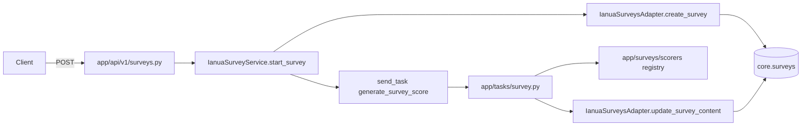

## Scope degli endpoint

Tutti sotto `/api/v1`, Bearer Cognito obbligatoria, envelope standard `{data, errors, meta}` via `ok_json` ([app/api/v1/util.py](app/api/v1/util.py)).

- `POST /patients/{patient_id}/surveys` — crea survey `pending`, dispatcha Celery per scoring (risk assessment integrato). Risposta `202`.
- `GET /patients/{patient_id}/surveys?type=&page=&page_size=` — storico con filtro per tipo.
- `GET /surveys/{survey_id}` — dettaglio singolo.
- `PATCH /surveys/{survey_id}` — aggiorna `responses` (o altro campo `content.*`); ri-dispatcha scoring se `responses` cambia.
- `GET /patients/{patient_id}/surveys/trend?type=` — serie `[{date, score, risk_level}]` ordinata per `created_at`.

## Decisioni di design

- **Template (mixed)**: registry Python in `app/surveys/templates/` con file `.json` SurveyJS-compatibili (es. `phq9.v1.json`, `gad7.v1.json`); loader `app/surveys/templates/__init__.py` con `get_template(type, version)` + `list_templates()`. La POST richiede `type` e opzionalmente `template_version` (default: latest).
- **Scoring async (Celery)**: nuovo task `app.tasks.survey.generate_survey_score` con routing queue `survey` in [app/celery.py](app/celery.py); import in `create_app` via `__import__("app.tasks.survey")` come per summary/transcription.
- **Scorer registry**: `app/surveys/scorers/` — uno scorer per tipo (`phq9.py`, `gad7.py`, `risk_assessment.py`), firma `score(responses: dict, template: dict) -> {score: int, risk_level: str, breakdown: dict}`. Il task seleziona lo scorer in base a `content.template_id`.
- **DB senza migrazione**: `core.surveys` ha già `content JSONB` ([specs/db/schema.sql:114](specs/db/schema.sql)). Tutto vive in `content`:

```json
{
  "template_id": "phq9",
  "template_version": "1",
  "status": "pending|processing|ready|failed",
  "responses": { "q1": 2, "q2": 1, ... },
  "score": 14,
  "risk_level": "moderate",
  "breakdown": { "depression": 14 },
  "error": null
}
```

Aggiornamento di `specs/db/feature-schema-tracking.md` per documentare questa convenzione (no migrazione).

- **Risk assessment integrato**: non è un endpoint separato. Lo scorer `risk_assessment` è un tipo come gli altri; quando lo scorer di un qualsiasi tipo produce `risk_level`, questo torna nel payload — integrato naturalmente.

## Architettura (vista flusso POST)




## File da creare

- `app/api/v1/surveys.py` (route; registrare in `app/api/v1/__init__.py`)
- `app/integrations/ianua_surveys.py` (`IanuaSurveysAdapter` + `IanuaSurveyService`; pattern unito per ridurre boilerplate)
- `app/surveys/__init__.py`, `app/surveys/templates/__init__.py`, `app/surveys/templates/phq9.v1.json`, `app/surveys/templates/gad7.v1.json`
- `app/surveys/scorers/__init__.py` (registry), `app/surveys/scorers/phq9.py`, `app/surveys/scorers/gad7.py`
- `app/tasks/survey.py` (task Celery)
- `specs/api/paths/surveys.yml`, `specs/api/paths/patient-surveys.yml`, `specs/api/paths/patient-surveys-trend.yml`, `specs/api/schemas/survey.yml`, `specs/api/schemas/survey-response.yml`, `specs/api/schemas/survey-list-response.yml`, `specs/api/schemas/survey-trend-response.yml`
- Test: `tests/test_surveys_api.py`, `tests/test_ianua_surveys_adapter.py`, `tests/test_celery_tasks.py` (estendi con casi survey), `tests/test_survey_scorers.py`

## File da modificare

- `app/api/v1/__init__.py` (import `surveys`)
- `app/api/v1/deps.py` (accessor `ianua_surveys()`)
- `app/__init__.py` (init `IanuaSurveysAdapter`/`IanuaSurveyService` e `__import__("app.tasks.survey")`)
- `app/celery.py` (`task_routes` per `app.tasks.survey.*` → `survey`)
- `specs/api/openapi.yml` (`$ref` ai nuovi path)
- `specs/api/api-endpoints-list.md` (marca gli endpoint come implementati)
- `specs/db/feature-schema-tracking.md` (documenta forma del JSONB `content`)

## Verifica finale

Al termine, esegui:

- `PYTHONPATH=. pytest -q` (tutti i test verdi, coverage ≥80% sui file nuovi)
- `python -m openapi_spec_validator specs/api/openapi.yml`
- `ruff check app/ tests/` e `mypy --strict app/` (se configurati; altrimenti segnala il gap)

