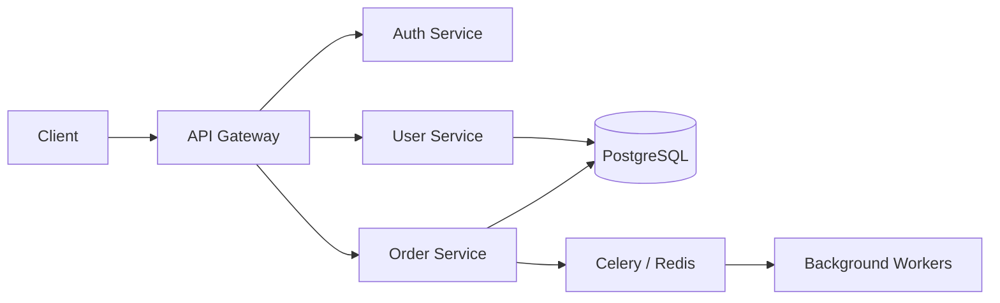
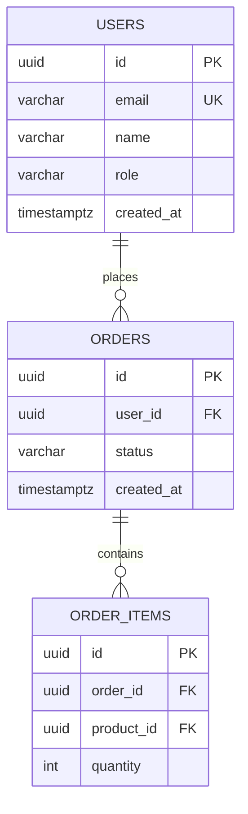

# Technical Documentation Patterns

Patterns for writing and maintaining backend technical documentation. Documentation is a **deliverable**, not an afterthought. Every code change that affects API surface, architecture, or database schema must include documentation updates.

## Architecture Decision Records (ADR)

Record significant architectural decisions with context, options, and rationale.

### Template

```markdown
# ADR-{NNN}: {Title}

## Status

{Proposed | Accepted | Deprecated | Superseded by ADR-XXX}

## Date

{YYYY-MM-DD}

## Context

{What is the issue we are facing? What forces are at play?
Describe the situation that requires a decision.}

## Decision

{What is the change that we are proposing and/or doing?
Be specific and actionable.}

## Options Considered

### Option 1: {Name}

- **Pros**: ...
- **Cons**: ...

### Option 2: {Name}

- **Pros**: ...
- **Cons**: ...

### Option 3: {Name}

- **Pros**: ...
- **Cons**: ...

## Consequences

### Positive

- {What becomes easier or better?}

### Negative

- {What becomes harder or worse?}

### Risks

- {What could go wrong? How do we mitigate it?}

## References

- {Links to relevant docs, tickets, discussions}
```

### When to write an ADR

- Choosing a framework, ORM, or major library
- Defining API versioning strategy
- Choosing authentication/authorization approach
- Database schema design decisions (normalization trade-offs, sharding)
- Introducing a new architectural pattern (CQRS, event sourcing)
- Any decision that a new team member would ask "why did you do it this way?"

### ADR guidelines

- Number sequentially: `ADR-001`, `ADR-002`, etc.
- Store in `docs/adr/` or `docs/architecture/decisions/`
- Never delete — mark as `Deprecated` or `Superseded`
- Keep them concise — 1-2 pages max
- Write them when the decision is made, not months later

## API Reference (OpenAPI / Swagger)

### FastAPI (auto-generated)

FastAPI auto-generates OpenAPI 3.x from route definitions and Pydantic models. Customize the spec:

```python
app = FastAPI(
    title="My Service API",
    version="1.0.0",
    description="Backend API for managing users and orders.",
    docs_url="/docs" if settings.environment != "production" else None,
    redoc_url="/redoc" if settings.environment != "production" else None,
)
```

Enhance auto-generated docs:
- Add `summary` and `description` to route decorators
- Use `response_model` for typed responses
- Add `responses` dict for error status codes
- Use Pydantic `Field(description=...)` for field documentation

### Django REST Framework with drf-spectacular

```python
# settings.py
SPECTACULAR_SETTINGS = {
    "TITLE": "My Service API",
    "VERSION": "1.0.0",
    "DESCRIPTION": "Backend API for managing users and orders.",
}

# urls.py
from drf_spectacular.views import SpectacularAPIView, SpectacularSwaggerView

urlpatterns = [
    path("api/schema/", SpectacularAPIView.as_view(), name="schema"),
    path("api/docs/", SpectacularSwaggerView.as_view(url_name="schema"), name="swagger-ui"),
]
```

### Standalone spec approach

Maintain an OpenAPI 3.x YAML/JSON file as the source of truth when not using auto-generation.

```yaml
openapi: 3.0.3
info:
  title: My Service API
  version: 1.0.0
  description: Backend API for managing users and orders.

servers:
  - url: http://localhost:8000
    description: Local development
  - url: https://api.example.com
    description: Production

paths:
  /users:
    post:
      summary: Create a new user
      operationId: createUser
      tags: [Users]
      requestBody:
        required: true
        content:
          application/json:
            schema:
              $ref: "#/components/schemas/CreateUserInput"
      responses:
        "201":
          description: User created
          content:
            application/json:
              schema:
                $ref: "#/components/schemas/UserResponse"
        "400":
          $ref: "#/components/responses/ValidationError"
        "409":
          $ref: "#/components/responses/ConflictError"
```

### Guidelines

- Every endpoint must be documented: path, method, params, body, responses, errors
- Include example values for request and response bodies
- Document authentication requirements per endpoint
- Keep the spec in sync — update it in the same PR as code changes
- Serve interactive docs (Swagger UI / ReDoc) in non-production environments

## System Architecture Document

### Structure

```markdown
# {Service Name} — Architecture

## Overview

{1-2 paragraph description of what this service does and why it exists.}

## System Diagram

{Mermaid diagram showing the service and its interactions.}

## Tech Stack

| Component | Technology | Version |
|-----------|-----------|---------|
| Runtime | Python | 3.12 |
| Framework | FastAPI | 0.11x |
| Database | PostgreSQL | 16 |
| ORM | SQLAlchemy | 2.x |
| Cache | Redis | 7.x |
| Queue | Celery | 5.x |

## Architecture

{Describe the architecture: layered, hexagonal, microservice, etc.
Explain the layer responsibilities and data flow.}

### Layers

- **Routers**: HTTP concerns, request parsing, response formatting
- **Services**: Business logic, orchestration, domain rules
- **Repositories**: Data access, ORM queries, entity mapping

### Key Design Decisions

- {Link to relevant ADRs: ADR-001, ADR-003}

## Data Model

{ER diagram in Mermaid or link to separate schema doc.}

## External Dependencies

| Dependency | Purpose | Failure Mode |
|-----------|---------|-------------|
| PostgreSQL | Primary data store | Service unavailable |
| Redis | Cache + rate limiting | Degraded (fallback to DB) |
| Payment API | Payment processing | Orders queue for retry |

## Security

{Authentication method, authorization model, key security controls.}

## Observability

{Logging, metrics, tracing, health check endpoints.}
```

### Mermaid diagrams

Use Mermaid for diagrams that live in Markdown files.



## Database Schema Documentation

### Structure

```markdown
# Database Schema

## Entity Relationship Diagram

{Mermaid ER diagram}

## Tables

### users

| Column | Type | Nullable | Default | Description |
|--------|------|----------|---------|-------------|
| id | uuid | NO | uuid7() | Primary key |
| email | varchar(255) | NO | - | Unique email address |
| name | varchar(100) | NO | - | Display name |
| role | varchar(20) | NO | 'user' | User role (admin, user, viewer) |
| password_hash | varchar(255) | NO | - | Bcrypt/argon2 hash |
| created_at | timestamptz | NO | now() | Creation timestamp |
| updated_at | timestamptz | NO | now() | Last update timestamp |
| deleted_at | timestamptz | YES | NULL | Soft delete timestamp |

**Indexes:**
- `users_pkey` — PRIMARY KEY (id)
- `users_email_unique` — UNIQUE (email) WHERE deleted_at IS NULL

### orders

{Same format...}
```

### ER diagram in Mermaid



## Setup / Onboarding Guide

### Structure

```markdown
# {Service Name} — Setup Guide

## Prerequisites

- Python >= 3.12
- uv (recommended) or poetry
- Docker (for local database and Redis)
- {Any other tools}

## Quick Start

1. Clone the repository
2. Install dependencies: `uv sync`
3. Copy environment file: `cp .env.example .env`
4. Start infrastructure: `docker compose up -d`
5. Run migrations: `alembic upgrade head`
6. Start development server: `uvicorn app.main:app --reload`

## Environment Variables

| Variable | Required | Default | Description |
|----------|----------|---------|-------------|
| DATABASE_URL | Yes | - | PostgreSQL connection string |
| REDIS_URL | No | redis://localhost:6379 | Redis connection string |
| JWT_SECRET | Yes | - | Secret for JWT signing |
| PORT | No | 8000 | HTTP server port |
| LOG_LEVEL | No | info | structlog log level |

## Common Tasks

### Run tests
`pytest`

### Run tests with coverage
`pytest --cov=src --cov-report=term-missing`

### Generate database migration
`alembic revision --autogenerate -m "description"`

### Apply migrations
`alembic upgrade head`

### Run type checker
`mypy --strict .`

### Run linter
`ruff check .`

### Format code
`ruff format .`

## Troubleshooting

### Database connection refused
Ensure Docker is running: `docker compose ps`

### Port already in use
Check for existing processes: `lsof -i :8000`
```

## Changelog

For tracking notable changes across versions.

### Format (Keep a Changelog)

```markdown
# Changelog

All notable changes to this project will be documented in this file.

## [Unreleased]

### Added
- User registration endpoint (`POST /users`)
- JWT authentication with refresh token rotation

### Changed
- Migrated from Flask to FastAPI for async support

### Fixed
- N+1 query in order listing endpoint

## [1.0.0] - 2026-03-15

### Added
- Initial release with user and order management
```

## Documentation Site with mkdocs

For projects that need a hosted documentation site:

```yaml
# mkdocs.yml
site_name: My Service
theme:
  name: material
nav:
  - Home: index.md
  - Architecture: architecture.md
  - API Reference: api-reference.md
  - Database Schema: database-schema.md
  - ADRs:
    - ADR-001 Framework Choice: adr/001-framework-choice.md
  - Setup Guide: setup.md
  - Changelog: changelog.md
plugins:
  - search
  - mkdocstrings:
      handlers:
        python:
          options:
            docstring_style: google
```

## Documentation Maintenance Rules

1. **Same PR rule**: documentation updates go in the same PR as code changes
2. **Review docs in code review**: treat doc changes as first-class review items
3. **Stale docs are worse than no docs**: if you can't keep it updated, don't write it
4. **Link, don't duplicate**: reference ADRs from architecture docs, not copy content
5. **Date everything**: ADRs, schema snapshots, and changelog entries have dates
