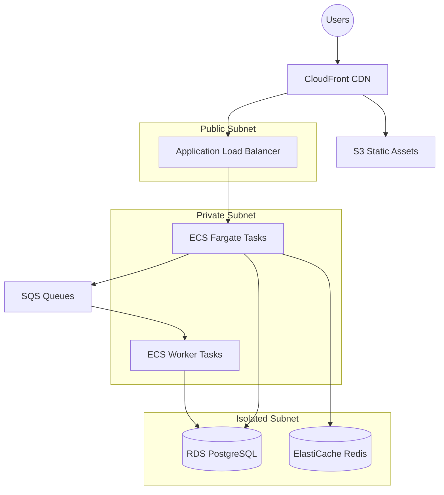
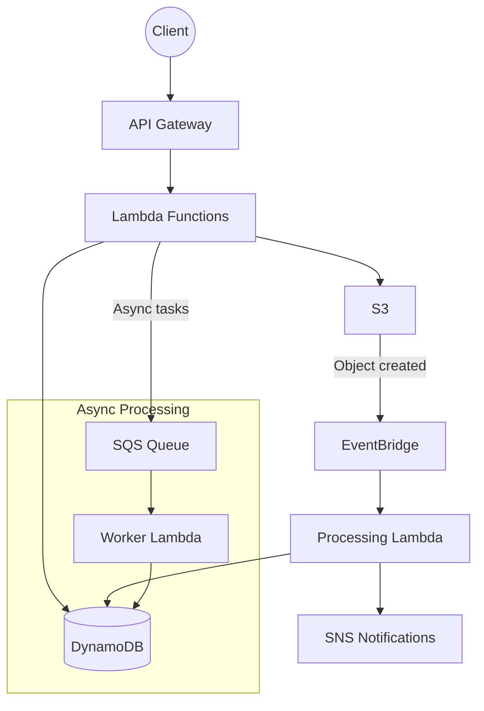
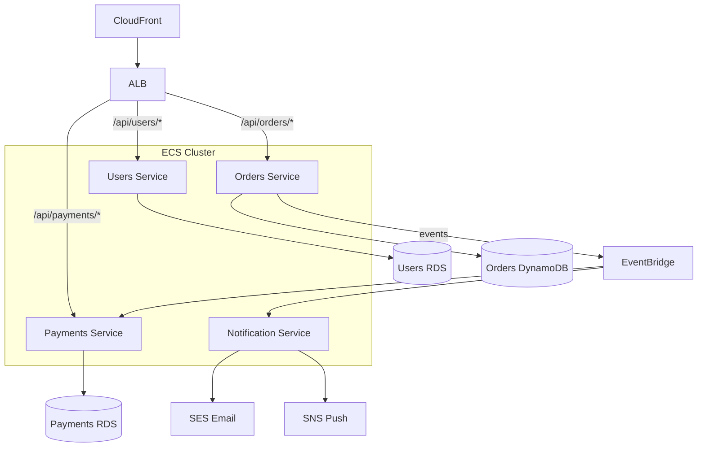
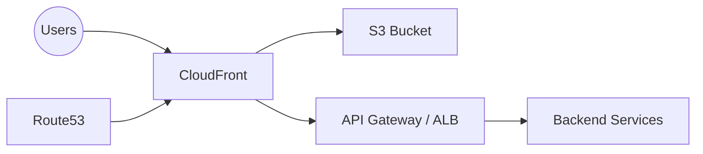

# AWS Architecture Patterns

Reference for `devops-aws-expert` skill — common AWS architectures and service selection.

---

## 3-Tier Web Application

The most common pattern for web applications with a backend API.

**Components:**
- **CDN**: CloudFront for static assets + API caching
- **Load Balancer**: ALB with path-based routing, SSL termination
- **Compute**: ECS Fargate (no server management)
- **Database**: RDS PostgreSQL/MySQL Multi-AZ
- **Cache**: ElastiCache Redis for sessions/caching
- **Queue**: SQS for async processing

**Cost estimate (small/medium):** ~$300-600/month

---

## Serverless Event-Driven

For event-driven workloads, APIs with variable traffic, or cost-sensitive projects.

**Components:**
- **API**: API Gateway (HTTP API for cost, REST API for features)
- **Compute**: Lambda functions (pay-per-invocation)
- **Database**: DynamoDB (serverless, pay-per-request)
- **Events**: EventBridge for event routing
- **Queue**: SQS for async processing with DLQ

**Cost estimate:** ~$5-50/month at low-medium traffic (scales with usage)

---

## Microservices on ECS

For larger applications with multiple independently deployable services.

**When to use microservices:**
- Multiple teams working on different domains
- Services need independent scaling
- Different technology choices per service
- Strong domain boundaries exist

**When NOT to use microservices:**
- Small team (< 5 developers)
- Early-stage product (start monolithic, extract later)
- Services share the same database

---

## Static Site Hosting

For SPAs (React, Vue, Angular) or static sites.

**Setup:**
- S3 bucket with public access blocked (OAC via CloudFront)
- CloudFront with custom error response for SPA routing (404 → `/index.html`)
- ACM certificate in `us-east-1` for CloudFront
- Route53 alias record pointing to CloudFront

---

## Service Selection Decision Tree

### Compute

| Criteria | Service |
|---|---|
| Containers, consistent traffic | ECS Fargate |
| Containers, cost-sensitive, can tolerate interruption | ECS on EC2 Spot |
| Short tasks (< 15 min), event-driven | Lambda |
| Full server control needed | EC2 |
| Containers with Kubernetes | EKS (only if team has K8s expertise) |

### Database

| Criteria | Service |
|---|---|
| Relational, complex queries | RDS PostgreSQL or Aurora |
| Key-value, high throughput | DynamoDB |
| Time series | Timestream |
| Document store | DocumentDB or DynamoDB |
| Graph | Neptune |
| In-memory cache | ElastiCache Redis |

### Messaging

| Criteria | Service |
|---|---|
| Task queue, at-least-once | SQS Standard |
| Task queue, exactly-once | SQS FIFO |
| Pub/sub, fan-out | SNS |
| Event routing, filtering | EventBridge |
| Streaming, ordered, replay | Kinesis Data Streams |

---

## Well-Architected Framework Alignment

Every architecture review should consider the six pillars:

### 1. Operational Excellence
- IaC for all resources
- Automated deployments
- Runbooks for operational procedures
- Monitoring and alerting

### 2. Security
- Least-privilege IAM
- Encryption at rest and in transit
- Private subnets for data stores
- Security scanning in CI

### 3. Reliability
- Multi-AZ deployments
- Auto-scaling
- Health checks and circuit breakers
- Backup and disaster recovery plan

### 4. Performance Efficiency
- Right-sized resources
- Caching at appropriate layers
- CDN for static content
- Async processing for non-critical paths

### 5. Cost Optimization
- Right-sizing based on metrics
- Reserved capacity for stable workloads
- Spot instances where applicable
- Storage lifecycle policies

### 6. Sustainability
- Minimize idle resources
- Use managed services (higher utilization)
- Right-size to actual demand

---

## Environment Strategy

| Environment | Purpose | Sizing | Multi-AZ |
|---|---|---|---|
| `dev` | Development, testing | Minimal (t3.micro, single-AZ) | No |
| `staging` | Pre-production validation | Production-like but smaller | Optional |
| `production` | Live traffic | Right-sized, auto-scaling | Yes |

**Rules:**
- All environments defined in IaC (same modules, different variables)
- Production changes must pass through staging first
- Dev can use cheaper alternatives (single-AZ RDS, smaller instances)
- Feature flags for testing in staging, not environment branching
