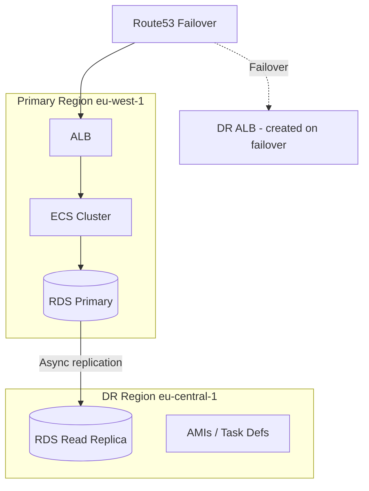

# Backup & Disaster Recovery Patterns

Reference for `devops-aws-expert` skill — data protection and recovery strategies.

---

## Backup Strategy by Service

### RDS

```hcl
resource "aws_db_instance" "main" {
  # ... other config ...

  backup_retention_period = var.environment == "production" ? 35 : 7
  backup_window           = "03:00-04:00"
  maintenance_window      = "mon:04:00-mon:05:00"

  copy_tags_to_snapshot = true
  deletion_protection   = var.environment == "production"
  skip_final_snapshot   = var.environment != "production"
  final_snapshot_identifier = var.environment == "production" ? "${local.name_prefix}-final" : null
}
```

**Backup types:**
- **Automated backups**: daily snapshots + transaction logs (point-in-time recovery up to retention period)
- **Manual snapshots**: persist until explicitly deleted, use before risky changes
- **Cross-region replication**: for DR, use `aws_db_instance_automated_backups_replication`

**Rules:**
- Production: 35-day retention minimum
- Take manual snapshot before any schema migration or major change
- Test restore quarterly

### S3

```hcl
resource "aws_s3_bucket_versioning" "main" {
  bucket = aws_s3_bucket.main.id
  versioning_configuration {
    status = "Enabled"
  }
}

resource "aws_s3_bucket_replication_configuration" "dr" {
  bucket = aws_s3_bucket.main.id
  role   = aws_iam_role.replication.arn

  rule {
    id     = "replicate-all"
    status = "Enabled"

    destination {
      bucket        = aws_s3_bucket.dr_replica.arn
      storage_class = "STANDARD_IA"
    }
  }
}
```

**Protection layers:**
1. Versioning — recover from accidental overwrites/deletes
2. Object Lock — prevent deletion (compliance mode for regulatory requirements)
3. Cross-region replication — DR copy in another region
4. Lifecycle rules — move old versions to cheaper storage, expire after retention period

### DynamoDB

```hcl
resource "aws_dynamodb_table" "main" {
  # ... other config ...

  point_in_time_recovery {
    enabled = true
  }
}

# On-demand backup
resource "aws_dynamodb_table_replica" "dr" {
  global_table_arn = aws_dynamodb_table.main.arn
  region_name      = "eu-central-1"
}
```

**Options:**
- **Point-in-time recovery (PITR)**: continuous backups, restore to any second in last 35 days
- **On-demand backups**: manual snapshots, persist until deleted
- **Global tables**: active-active replication across regions

### EBS

```hcl
# Automated snapshots via AWS Backup
resource "aws_backup_plan" "ebs" {
  name = "${local.name_prefix}-ebs-backup"

  rule {
    rule_name         = "daily"
    target_vault_name = aws_backup_vault.main.name
    schedule          = "cron(0 3 * * ? *)"  # Daily at 3 AM

    lifecycle {
      delete_after = var.environment == "production" ? 35 : 7
    }

    copy_action {
      destination_vault_arn = aws_backup_vault.dr.arn  # Cross-region
      lifecycle {
        delete_after = 90
      }
    }
  }
}
```

---

## DR Tiers

| Tier | Strategy | RPO | RTO | Cost | Use when |
|---|---|---|---|---|---|
| **Backup & Restore** | Backups in another region, restore on demand | Hours | Hours | $ | Non-critical workloads |
| **Pilot Light** | Minimal resources running in DR region | Minutes | 30-60 min | $$ | Moderate criticality |
| **Warm Standby** | Scaled-down replica running in DR region | Minutes | 15-30 min | $$$ | Business-critical |
| **Multi-Site Active** | Full deployment in multiple regions | Near-zero | Minutes | $$$$ | Mission-critical |

### RPO and RTO Definitions

- **RPO (Recovery Point Objective)**: maximum acceptable data loss (time)
- **RTO (Recovery Time Objective)**: maximum acceptable downtime (time)

### Pilot Light Architecture



**Failover procedure:**
1. Promote RDS read replica to primary
2. Launch ECS tasks from existing task definitions
3. Create/enable ALB and target groups
4. Update Route53 failover record
5. Verify service health

---

## AWS Backup

Centralized backup management across services.

```hcl
resource "aws_backup_vault" "main" {
  name        = "${local.name_prefix}-vault"
  kms_key_arn = aws_kms_key.backup.arn
}

resource "aws_backup_plan" "main" {
  name = "${local.name_prefix}-backup-plan"

  rule {
    rule_name         = "daily"
    target_vault_name = aws_backup_vault.main.name
    schedule          = "cron(0 3 * * ? *)"
    start_window      = 60    # minutes
    completion_window = 180   # minutes

    lifecycle {
      cold_storage_after = 30
      delete_after       = 365
    }
  }

  rule {
    rule_name         = "weekly"
    target_vault_name = aws_backup_vault.main.name
    schedule          = "cron(0 3 ? * SUN *)"

    lifecycle {
      delete_after = 365
    }
  }
}

resource "aws_backup_selection" "main" {
  name         = "${local.name_prefix}-selection"
  iam_role_arn = aws_iam_role.backup.arn
  plan_id      = aws_backup_plan.main.id

  # Select resources by tag
  selection_tag {
    type  = "STRINGEQUALS"
    key   = "Backup"
    value = "true"
  }
}
```

**Supported services:**
- RDS, Aurora, DynamoDB
- EBS, EFS, FSx
- S3 (with versioning)
- EC2 (AMI-based)

---

## Failover Testing

**Quarterly DR drill checklist:**

1. **Pre-drill**: notify stakeholders, verify backups exist, document current state
2. **Simulate failure**: stop primary resources (or use Route53 health check manipulation)
3. **Execute failover**: follow runbook procedure
4. **Validate**: verify data integrity, test critical paths, check metrics
5. **Measure**: record actual RTO and RPO, compare to targets
6. **Failback**: restore primary region, re-establish replication
7. **Post-drill**: document findings, update runbooks, fix gaps

**Game days:**
- Schedule quarterly failover tests
- Rotate on-call engineers who execute the drill
- Track improvements in RTO/RPO over time
- Automate failover steps progressively

---

## Pre-Change Backup Checklist

Before any infrastructure modification:

- [ ] Identify all data stores affected
- [ ] Take manual snapshots of affected databases
- [ ] Verify snapshots completed successfully
- [ ] Note current resource configurations (for manual rollback)
- [ ] Confirm rollback procedure is documented
- [ ] Test restore in non-production environment (for major changes)
- [ ] Communicate change window to stakeholders
