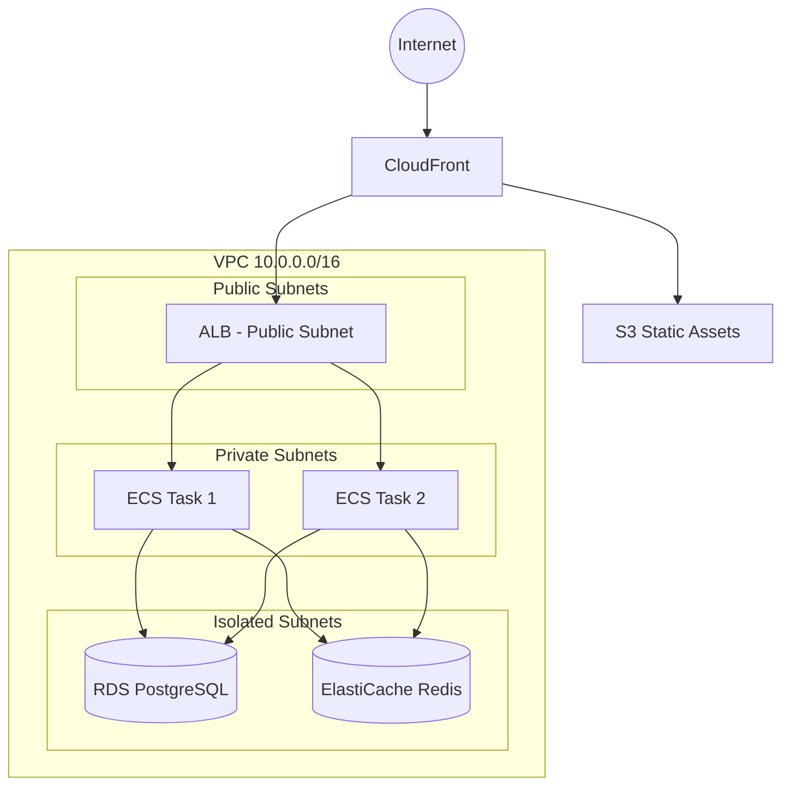
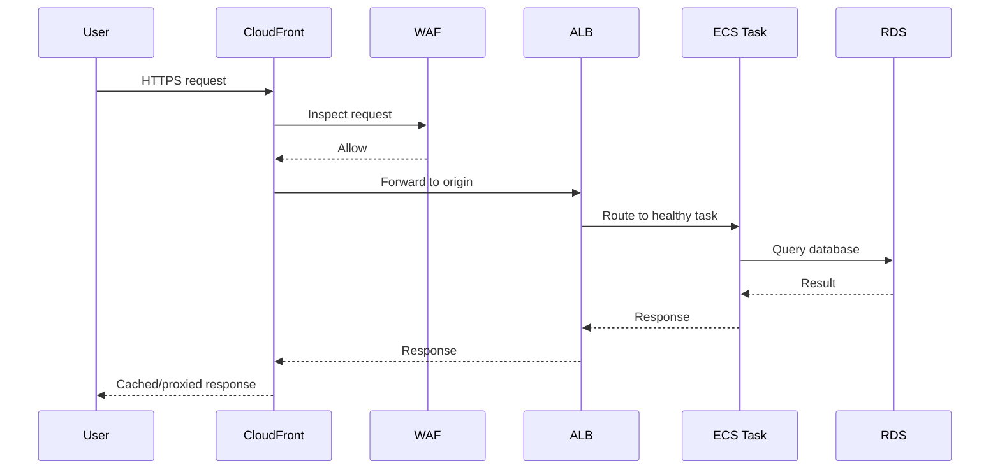
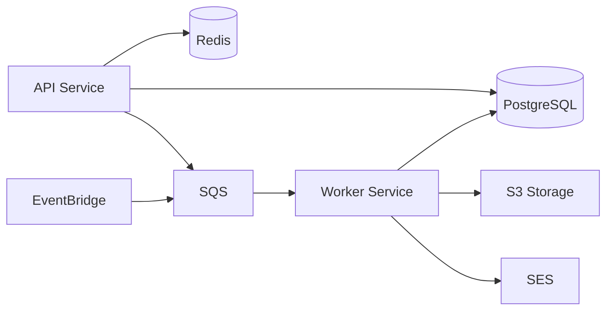

# Infrastructure Documentation Patterns

Reference for `devops-aws-expert` skill — documentation standards for infrastructure.

---

## Architecture Diagrams

### Mermaid Diagram Types

Use Mermaid for all infrastructure diagrams — they live in code, version with git, and render in GitHub/GitLab.

**Infrastructure Topology:**


**Network Flow:**


**Service Dependencies:**


### Diagram Rules

- Update diagrams in the same PR as IaC changes
- Include VPC/subnet boundaries
- Show security group relationships
- Label with resource types and key configuration (instance sizes, CIDR ranges)
- Keep diagrams focused — one per concern (topology, network flow, dependencies)

---

## Runbook Writing

Every critical service needs a runbook. Structure:

### Runbook Structure

```markdown
# RUN-001: Service Name — Issue Type

## Symptoms
- What alerts fire
- What users experience
- What metrics look like

## Diagnosis
1. Check CloudWatch dashboard: [link]
2. Check logs: `aws logs tail /ecs/myapp-api --filter-pattern "ERROR"`
3. Check service health: `aws ecs describe-services --cluster X --services Y`

## Resolution
### Scenario A: High Error Rate
1. Step-by-step fix
2. Commands to run
3. Expected outcome

### Scenario B: Resource Exhaustion
1. Step-by-step fix
2. Commands to run

## Rollback
1. How to revert to last known good state
2. Commands for rollback
3. Verification steps

## Escalation
- P0: Contact [team/person], page via PagerDuty
- If unresolved after 30 minutes: escalate to [senior engineer]

## Post-Incident
- Create incident report
- Update this runbook with new findings
- Create tickets for preventive measures
```

### Runbook Rules

- Every alarm must link to its runbook
- Write for someone who has never seen this system
- Include exact commands, not just descriptions
- Test runbook steps during DR drills
- Update after every incident where the runbook was insufficient

---

## Decision Log

Infrastructure decision records (similar to ADRs) document why choices were made.

### When to Create a Decision Record

- Choosing between AWS services (e.g., ECS vs Lambda)
- Selecting infrastructure patterns (e.g., single-region vs multi-region)
- Making cost vs performance trade-offs
- Changing existing infrastructure significantly
- Choosing third-party tools or services

### Decision Record Format

See `templates/infra-decision-log-template.md` for the full template.

**Key sections:**
- **Context**: what problem are we solving, what constraints exist
- **Options**: list alternatives with pros/cons and cost estimates
- **Decision**: what we chose and why
- **Consequences**: what changes, what risks remain

### Numbering

- Sequential: `INFRA-001`, `INFRA-002`, etc.
- Never reuse numbers, even for superseded decisions
- Reference related decisions: "Supersedes INFRA-003"

---

## Resource Inventory

Maintain a catalog of all infrastructure resources:

```markdown
# Resource Inventory

## Compute
| Resource | Service | Type | Environment | Monthly Cost | Owner |
|---|---|---|---|---|---|
| myapp-api | ECS Fargate | 0.5 vCPU, 1GB | production | ~$45 | backend team |
| myapp-worker | ECS Fargate | 0.25 vCPU, 0.5GB | production | ~$25 | backend team |

## Data Stores
| Resource | Service | Type | Environment | Monthly Cost | Owner |
|---|---|---|---|---|---|
| myapp-db | RDS PostgreSQL | db.t3.medium, Multi-AZ | production | ~$140 | backend team |
| myapp-cache | ElastiCache Redis | cache.t4g.micro | production | ~$15 | backend team |

## Networking
| Resource | Service | Type | Monthly Cost |
|---|---|---|---|
| myapp-vpc | VPC | 10.0.0.0/16 | — |
| myapp-nat | NAT Gateway | 1x (single AZ) | ~$32 |
```

**Update triggers:**
- New resource created
- Resource type changed (scaling up/down)
- Resource deleted
- Monthly cost review

---

## Same-PR Rule

**Infrastructure documentation MUST be updated in the same PR as IaC changes.**

This means:
- New resource → update architecture diagram + resource inventory
- New service → create runbook + update service dependency diagram
- Architecture change → new decision record + update diagrams
- Decommission → update inventory, mark runbook as deprecated

**Enforcement**: reviewers should check for documentation updates in every infrastructure PR.

---

## Onboarding Documentation

Every project needs an infrastructure onboarding doc:

```markdown
# Infrastructure Onboarding

## Prerequisites
- AWS account access (request via [process])
- AWS CLI configured with SSO: `aws sso login --profile myapp`
- Terraform >= 1.5.0 installed
- Docker installed

## Architecture Overview
[Link to architecture diagram]

## Environments
| Environment | AWS Account | Region | Access |
|---|---|---|---|
| dev | 111111111111 | eu-west-1 | All engineers |
| staging | 222222222222 | eu-west-1 | All engineers |
| production | 333333333333 | eu-west-1 | Senior engineers + on-call |

## Common Tasks
- Deploy to staging: merge to `main` (auto-deploy)
- Deploy to production: manual approval in GitHub Actions
- View logs: `aws logs tail /ecs/myapp-api --follow`
- SSH to bastion: `aws ssm start-session --target i-xxx`

## Runbooks
[Links to all runbooks]

## Contacts
- Infrastructure questions: #team-platform in Slack
- On-call: [PagerDuty schedule link]
```

---

## Documentation Review Checklist

Before approving an infrastructure PR:

- [ ] Architecture diagrams updated (if topology changed)
- [ ] Runbook created or updated (if new/changed service)
- [ ] Decision record created (if significant choice made)
- [ ] Resource inventory updated (if resources added/removed/changed)
- [ ] Cost estimate included in PR description
- [ ] Onboarding doc updated (if access patterns changed)
