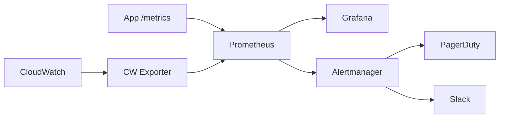

# Monitoring & Observability

Reference for `devops-aws-expert` skill — the four pillars of observability.

---

## Logging

### Structured Logging

All application logs must be structured JSON:

```json
{
  "timestamp": "2024-01-15T10:30:00.000Z",
  "level": "error",
  "message": "Failed to process order",
  "service": "order-api",
  "environment": "production",
  "traceId": "abc123",
  "orderId": "ORD-456",
  "error": {
    "type": "DatabaseConnectionError",
    "message": "Connection timeout after 5000ms"
  }
}
```

**Rules:**
- JSON format — no plain text logs in production
- Include: timestamp, level, message, service name, environment, trace ID
- Include contextual fields relevant to the operation
- Never log secrets, PII, or full request/response bodies
- Use log levels consistently: `debug` → `info` → `warn` → `error` → `fatal`

### CloudWatch Logs Configuration

```hcl
resource "aws_cloudwatch_log_group" "app" {
  name              = "/ecs/${local.name_prefix}-api"
  retention_in_days = var.environment == "production" ? 90 : 30
  kms_key_id        = aws_kms_key.logs.arn
}
```

### Retention Policies

| Environment | Retention | Rationale |
|---|---|---|
| Production | 90 days | Compliance, incident investigation |
| Staging | 30 days | Debugging |
| Development | 14 days | Cost savings |

### CloudWatch Logs Insights Queries

```
# Error rate by service
fields @timestamp, @message
| filter level = "error"
| stats count() as errorCount by service
| sort errorCount desc

# Slow requests (> 1 second)
fields @timestamp, method, path, duration
| filter duration > 1000
| sort duration desc
| limit 50

# Error trends over time
fields @timestamp
| filter level = "error"
| stats count() as errors by bin(5m)
```

### Log Aggregation

- Use CloudWatch Logs as the primary aggregation point
- ECS tasks: use `awslogs` log driver (sends directly to CloudWatch)
- Lambda: automatic CloudWatch integration
- For advanced analysis: export to S3 via subscription filter, query with Athena

---

## Alerting

### Severity Levels

| Level | Description | Response time | Examples |
|---|---|---|---|
| **P0** | Service down, data loss risk | Immediate (< 5 min) | API completely unresponsive, database corruption |
| **P1** | Degraded service, significant impact | < 15 min | Error rate > 5%, latency > 5x normal |
| **P2** | Partial impact, workaround exists | < 1 hour | Single endpoint failing, non-critical job stuck |
| **P3** | Minor issue, no user impact | Next business day | Disk usage warning, certificate expiring in 30 days |

### Alarm Configuration

```hcl
# P0: API error rate > 10%
resource "aws_cloudwatch_metric_alarm" "api_error_rate" {
  alarm_name          = "${local.name_prefix}-api-error-rate-critical"
  comparison_operator = "GreaterThanThreshold"
  evaluation_periods  = 2
  threshold           = 10
  alarm_description   = "API error rate exceeds 10%. Runbook: docs/specs/devops/runbooks/RUN-001-api-errors.md"

  metric_query {
    id          = "error_rate"
    expression  = "(errors / total) * 100"
    label       = "Error Rate %"
    return_data = true
  }

  metric_query {
    id = "errors"
    metric {
      metric_name = "5XXError"
      namespace   = "AWS/ApplicationELB"
      period      = 60
      stat        = "Sum"
      dimensions  = { LoadBalancer = aws_lb.main.arn_suffix }
    }
  }

  metric_query {
    id = "total"
    metric {
      metric_name = "RequestCount"
      namespace   = "AWS/ApplicationELB"
      period      = 60
      stat        = "Sum"
      dimensions  = { LoadBalancer = aws_lb.main.arn_suffix }
    }
  }

  alarm_actions = [aws_sns_topic.p0_alerts.arn]
  ok_actions    = [aws_sns_topic.p0_alerts.arn]
}
```

### Escalation Paths

```
P0 → SNS → PagerDuty (on-call engineer) → Slack #incidents
P1 → SNS → PagerDuty (on-call engineer) → Slack #alerts
P2 → SNS → Slack #alerts
P3 → SNS → Slack #monitoring
```

### Alert Fatigue Prevention

- **No noisy alarms**: if an alarm fires more than 3x/week without action needed, tune or remove it
- **Actionable alarms only**: every alarm must link to a runbook
- **Composite alarms**: combine related alarms to reduce noise
- **Auto-resolve**: configure OK actions to auto-close incidents
- **Maintenance windows**: suppress alarms during planned maintenance

---

## Metrics

### Custom CloudWatch Metrics

```hcl
# Custom metric for business KPIs
resource "aws_cloudwatch_metric_alarm" "orders_per_minute" {
  alarm_name          = "${local.name_prefix}-orders-low"
  comparison_operator = "LessThanThreshold"
  evaluation_periods  = 5
  metric_name         = "OrdersProcessed"
  namespace           = "MyApp/Business"
  period              = 60
  statistic           = "Sum"
  threshold           = 10
  alarm_description   = "Orders per minute below threshold. Runbook: RUN-003"
  alarm_actions       = [aws_sns_topic.p1_alerts.arn]
}
```

### Dashboard Design

**Operational Dashboard** (for on-call):
- Request rate, error rate, latency (p50, p95, p99)
- CPU/memory utilization per service
- Database connections, query latency
- Queue depth, processing rate
- Active alarms

**Executive Dashboard** (for stakeholders):
- Uptime percentage
- Request volume trends
- Error budget remaining
- Cost trends
- Key business metrics

### SLI / SLO / SLA

| Term | Definition | Example |
|---|---|---|
| **SLI** (Indicator) | Metric measuring service quality | Request latency p99 |
| **SLO** (Objective) | Target value for SLI | p99 latency < 500ms, 99.9% availability |
| **SLA** (Agreement) | Contractual commitment with consequences | 99.9% uptime or credits |

### Error Budget

```
Monthly error budget = 1 - SLO target
For 99.9% availability SLO:
  Error budget = 0.1% = 43.2 minutes/month

Track: (actual uptime - SLO target) / (100% - SLO target)
```

- When error budget is consumed: freeze non-critical deployments, focus on reliability
- When error budget is healthy: green light for feature deployments
- Review error budget weekly

### Anomaly Detection

```hcl
resource "aws_cloudwatch_metric_alarm" "latency_anomaly" {
  alarm_name          = "${local.name_prefix}-latency-anomaly"
  comparison_operator = "GreaterThanUpperThreshold"
  evaluation_periods  = 3
  threshold_metric_id = "ad1"

  metric_query {
    id          = "ad1"
    expression  = "ANOMALY_DETECTION_BAND(m1, 2)"
    label       = "Latency (expected)"
    return_data = true
  }

  metric_query {
    id = "m1"
    metric {
      metric_name = "TargetResponseTime"
      namespace   = "AWS/ApplicationELB"
      period      = 300
      stat        = "p99"
      dimensions  = { LoadBalancer = aws_lb.main.arn_suffix }
    }
    return_data = true
  }
}
```

---

## Tracing

### AWS X-Ray

```hcl
# Enable X-Ray for ECS tasks
resource "aws_ecs_task_definition" "app" {
  # ... other config ...

  container_definitions = jsonencode([
    {
      name  = "app"
      image = "${aws_ecr_repository.app.repository_url}:${var.image_tag}"
      environment = [
        { name = "AWS_XRAY_DAEMON_ADDRESS", value = "localhost:2000" }
      ]
    },
    {
      name  = "xray-daemon"
      image = "amazon/aws-xray-daemon:latest"
      portMappings = [{ containerPort = 2000, protocol = "udp" }]
    }
  ])
}
```

### Sampling Strategy

| Environment | Sampling rate | Rationale |
|---|---|---|
| Production | 5-10% | Cost control, sufficient for analysis |
| Staging | 100% | Full visibility for debugging |
| Development | 100% | Full visibility |

**Always sample 100% of errors** regardless of the general sampling rate.

### Service Map

X-Ray automatically generates a service map showing:
- Service dependencies
- Latency between services
- Error rates per edge
- Bottleneck identification

Use this for:
- Understanding request flow through microservices
- Identifying slow downstream dependencies
- Capacity planning

---

## Prometheus + Grafana

For custom metrics beyond CloudWatch:

### When to use Prometheus + Grafana

- Need sub-minute metric resolution
- Want custom dashboards with Grafana's visualization
- Already have Prometheus expertise on the team
- Need to aggregate metrics across AWS accounts

### Architecture



### Managed Options

- **Amazon Managed Prometheus (AMP)**: serverless Prometheus-compatible monitoring
- **Amazon Managed Grafana (AMG)**: managed Grafana with SSO integration
- These reduce operational overhead vs self-hosted

---

## Essential Alarms Checklist

Every production service must have these alarms before launch:

| Alarm | Metric | Threshold | Severity |
|---|---|---|---|
| High error rate | ALB 5XX / total | > 5% for 5 min | P0 |
| High latency | ALB p99 response time | > 2s for 5 min | P1 |
| High CPU | ECS CPU utilization | > 80% for 10 min | P2 |
| High memory | ECS memory utilization | > 80% for 10 min | P2 |
| DB connections | RDS connections | > 80% of max | P1 |
| DB CPU | RDS CPU utilization | > 80% for 10 min | P1 |
| Queue depth | SQS ApproximateNumberOfMessages | > 1000 for 15 min | P2 |
| DLQ messages | SQS DLQ messages visible | > 0 | P1 |
| Disk usage | EBS/EFS utilization | > 80% | P2 |
| Certificate expiry | ACM days to expiry | < 30 days | P3 |
